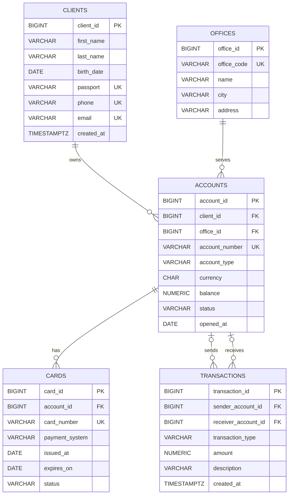

# Лабораторная работа №1
## "Проектирование и реализация реляционной базы данных"

### Предметная область

Реализованная база данных представляет собой простейшую банковскую систему. Она хранит данные о клиентах банка, отделениях, банковских счетах, выпущенных картах и денежных операциях.

Один клиент может иметь несколько счетов. Каждый счёт открывается в одном отделении и может иметь несколько карт. Счета участвуют в операциях как отправители или получатели.

### ER-диаграмма

### Основные проектные решения

Для каждой сущности банковской системы создана отдельная таблица. Каждая запись имеет первичный ключ типа BIGINT, который автоматически создаётся PostgreSQL.

Связи между таблицами реализованы внешними ключами:
- accounts.client_id связывает счёт с клиентом.
- accounts.office_id связывает счёт с отделением.
- cards.account_id связывает карту со счётом.
- transcations.sender_account_id/receiver_account_id связывают операцию со счетами.

Для денежных значений используется тип NUMERIC(15, 2), так как он хранит точные десятичные значения и хорошо подходит для финансовых данных.

Правило ON DELETE RESTRICT запрещает удалять клиента/отделение/счёт, если с ними связаны важные записи.

Правило ON DELETE CASCADE используется для связи между счетами и картами, так как карта не может существовать без счёта.

Используются ограничения:
- NOT NULL
- UNIQUE
- CHECK
- PRIMARY KEY
- FOREIGN KEY

Также используются составные ограничения:
1. UNIQUE (city, address), которое запрещает создавать два отделения с одинаковым адресом в одном городе.
2. CHECK таблицы transactions определяет участников операции.

## Обоснование приведения модели к 3НФ

+ Первая нормальная форма
Все столбцы содержат атомарные значения. Каждая ячейка хранит только одно значение.

+ Вторая нормальная форма
Каждая таблица имеет первичный ключ из одного столбца. Все остальные столбцы полностью зависят от этого ключа.

+ Третья нормальная форма
Неключевые атрибуты не зависят друг от друга и не дублируются мжду таблицами.

